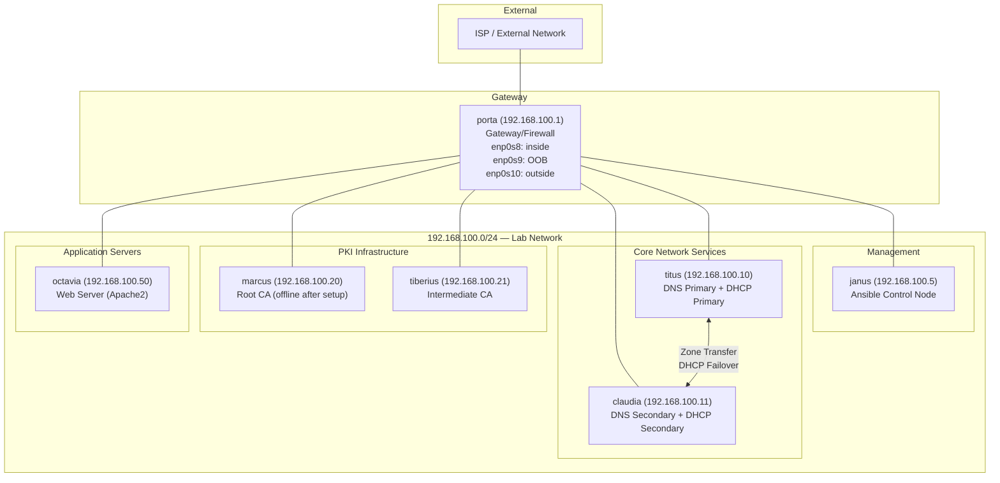
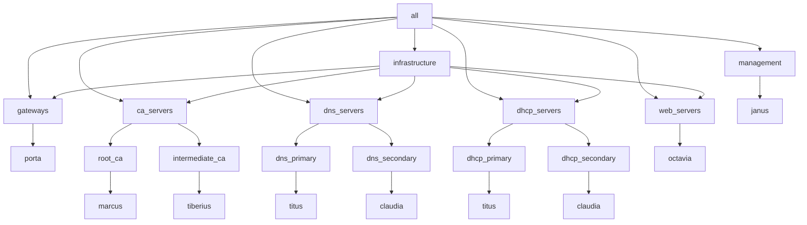
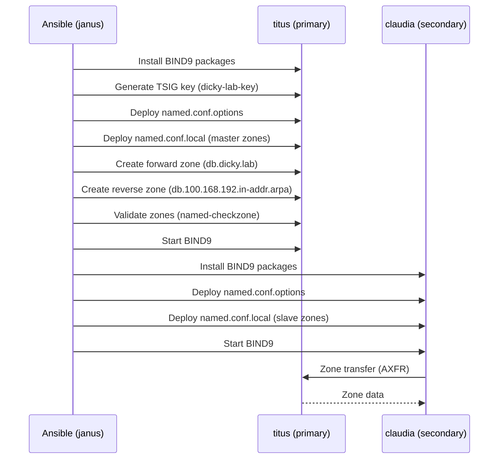
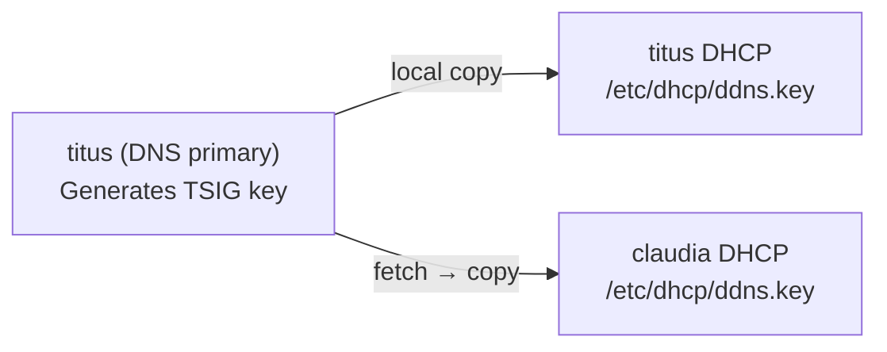
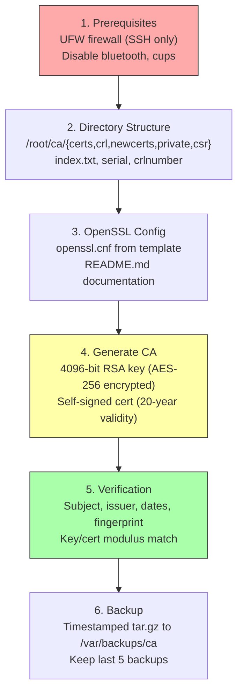

# Dicky Lab Bootstrap Guide

> Complete procedure for bootstrapping the Dicky Lab infrastructure from bare metal to fully operational services.

## Table of Contents

- [[#Architecture Overview]]
- [[#Prerequisites]]
- [[#Network Architecture]]
- [[#Inventory Reference]]
- [[#Phase 1 — Control Node Setup (janus)]]
- [[#Phase 2 — Common Baseline (all hosts)]]
- [[#Phase 3 — Network Configuration (all hosts)]]
- [[#Phase 4 — DNS Infrastructure (titus + claudia)]]
- [[#Phase 5 — DHCP Infrastructure (titus + claudia)]]
- [[#Phase 6 — DNS Cutover]]
- [[#Phase 7 — Root CA (marcus)]]
- [[#Phase 8 — Full Site Deployment]]
- [[#Tag Reference]]
- [[#Troubleshooting]]

---

## Architecture Overview



### Service Dependency Chain


> [!important]
> DNS must be running before DHCP because DHCP uses Dynamic DNS (DDNS) to register leases. DHCP deployment will fail if BIND9 is not reachable.

---

## Prerequisites

### Hardware / VMs

| Host | Role | vCPUs | RAM | Disk | OS |
|------|------|-------|-----|------|----|
| janus | Ansible control node | 1 | 1 GB | 20 GB | Ubuntu 20.04+ |
| porta | Gateway/firewall | 1 | 1 GB | 20 GB | Ubuntu 20.04+ |
| titus | DNS/DHCP primary | 2 | 2 GB | 20 GB | Ubuntu 20.04+ |
| claudia | DNS/DHCP secondary | 2 | 2 GB | 20 GB | Ubuntu 20.04+ |
| marcus | Root CA | 1 | 1 GB | 20 GB | Ubuntu 20.04+ |
| tiberius | Intermediate CA | 1 | 1 GB | 20 GB | Ubuntu 20.04+ |
| octavia | Web server | 2 | 2 GB | 40 GB | Ubuntu 20.04+ |

### Network Interfaces

Every host requires **two** network interfaces:

| Interface | Purpose | Network |
|-----------|---------|---------|
| `enp0s8` | Lab production network | `192.168.100.0/24` (static) |
| `enp0s9` | Out-of-band management | DHCP (routes and DNS isolated) |

`porta` has a third interface (`enp0s10`) for the external/WAN connection.

### Before You Begin

1. **All VMs are provisioned** with Ubuntu 20.04+ and SSH enabled
2. **User `rdodswor`** exists on all hosts with sudo privileges (NOPASSWD recommended)
3. **SSH key** (`~/.ssh/id_ed25519`) is distributed to all hosts:
   ```bash
   # From janus, distribute your key to all hosts
   for host in porta titus claudia marcus tiberius octavia; do
       ssh-copy-id -i ~/.ssh/id_ed25519 rdodswor@192.168.100.X
   done
   ```
4. **Static IPs are temporarily configured** on `enp0s8` for initial SSH access (Ansible will enforce the final netplan config)
5. **Ansible Vault password** is stored at `~/.vault_pass` on janus:
   ```bash
   # Create the vault password file
   echo 'your-vault-password' > ~/.vault_pass
   chmod 600 ~/.vault_pass
   ```
6. **Ansible is installed** on janus:
   ```bash
   sudo apt update && sudo apt install -y ansible python3-pip python3-venv git
   ```
7. **The repo is cloned** to `~/ansible` on janus

### Verify Connectivity

```bash
# From janus — quick reachability check
ansible all -m ping
```

Expected: all 7 hosts return `pong`. If any fail, fix SSH access before proceeding.

---

## Network Architecture

### IP Address Plan

| IP | Hostname | Function | MAC (enp0s8) |
|----|----------|----------|-------------|
| 192.168.100.1 | porta | Gateway | `02:DD:04:01:01:01` |
| 192.168.100.5 | janus | Management / Ansible | — |
| 192.168.100.10 | titus | DNS primary + DHCP primary | `02:dc:03:01:01:01` |
| 192.168.100.11 | claudia | DNS secondary + DHCP secondary | `02:dc:03:02:01:01` |
| 192.168.100.20 | marcus | Root CA | `02:dc:02:01:01:01` |
| 192.168.100.21 | tiberius | Intermediate CA | `02:dc:02:02:01:01` |
| 192.168.100.50 | octavia | Web server | — |
| 192.168.100.100–199 | — | DHCP pool | Dynamic |

### DNS Architecture

| Record Type | Example | Source |
|-------------|---------|--------|
| A records | `titus.dicky.lab → 192.168.100.10` | Static in zone template |
| PTR records | `10.100.168.192.in-addr.arpa → titus.dicky.lab` | Static in reverse zone |
| CNAME aliases | `ns1 → titus`, `ns2 → claudia`, `root-ca → marcus`, `www → octavia` | Zone template |
| DDNS entries | Dynamic DHCP clients | Managed by ISC DHCP via TSIG key |

### OOB Interface Isolation

Every host's `enp0s9` (OOB) interface is configured with DHCP overrides to prevent it from injecting routes or DNS into the main routing table:

```yaml
dhcp4_overrides:
  use_routes: false
  use_dns: false
```

This ensures all production traffic flows through `enp0s8` on the `192.168.100.0/24` network.

---

## Inventory Reference

### Group Hierarchy



### Key Variables by Scope

| Scope | File | Variables |
|-------|------|-----------|
| Global | `group_vars/all.yml` | `lab_name`, `lab_domain`, `ssh_port`, `root_ca_passphrase` (vault-encrypted) |
| DNS servers | `group_vars/dns_servers.yml` | `dns_domain`, zones, forwarders, TTLs, DDNS key settings |
| DHCP servers | `group_vars/dhcp_servers.yml` | subnet, pool range, failover config, DDNS settings |
| CA servers | `group_vars/ca_servers.yml` | DN defaults, key size, permissions, backup settings |
| Root CA | `group_vars/root_ca.yml` | 20-year validity, offline flag |
| Intermediate CA | `group_vars/intermediate_ca.yml` | 10-year validity, online flag |
| Per-host | `host_vars/<hostname>.yml` | interfaces, role-specific settings, packages |

---

## Phase 1 — Control Node Setup (janus)

> [!note]
> This phase is manual. Ansible cannot bootstrap itself.

### 1.1 Install Ansible and dependencies

```bash
sudo apt update
sudo apt install -y ansible python3-pip python3-venv git rsync
ansible-galaxy collection install community.general
```

### 1.2 Clone the repository

```bash
cd ~ && git clone <repo-url> ansible
cd ~/ansible
```

### 1.3 Configure vault password

```bash
echo 'your-vault-password' > ~/.vault_pass
chmod 600 ~/.vault_pass
```

### 1.4 Verify the setup

```bash
# Check ansible.cfg is found
ansible --version

# Test connectivity to all hosts
ansible all -m ping

# List inventory
ansible-inventory --list
```

**Expected:** All hosts reachable, inventory shows correct groups and variables.

---

## Phase 2 — Common Baseline (all hosts)

Deploys timezone, packages, chrony NTP, and unattended-upgrades to every host.

### 2.1 Dry run

```bash
ansible-playbook playbooks/common.yml --check --diff
```

### 2.2 Deploy

```bash
ansible-playbook playbooks/common.yml
```

### What this does

| Component | Detail |
|-----------|--------|
| Timezone | `Australia/Adelaide` |
| Packages | vim, tmux, htop, ncdu, curl, wget, net-tools, dnsutils, tcpdump, git, rsync, tree, lsof, jq, traceroute |
| Host packages | Per-host extras (openssl/easy-rsa on CA servers, apache2 on octavia, ansible on janus) |
| NTP | Chrony configured with AU pool servers, `makestep 1 -1` for VM suspend/resume |
| Security | unattended-upgrades for automatic security patching |

### 2.3 Verify

```bash
ansible-playbook playbooks/common.yml --tags verify
```

This runs the post_tasks: chrony status check and time synchronization verification.

Manual spot-check:

```bash
# Check chrony on any host
ansible all -m command -a "chronyc tracking" --limit titus
```

---

## Phase 3 — Network Configuration (all hosts)

Deploys static netplan configuration and disables cloud-init network management.

### 3.1 Dry run

> [!warning]
> Network changes can disconnect SSH. The netplan handler uses `sleep 2 && netplan apply` with `async` to prevent lockout, but always have OOB access ready.

```bash
ansible-playbook playbooks/network_config.yml --check --diff
```

### 3.2 Deploy

```bash
ansible-playbook playbooks/network_config.yml
```

### What this does

1. Disables cloud-init network management (`/etc/cloud/cloud.cfg.d/99-disable-network-config.cfg`)
2. Removes cloud-init netplan (`/etc/netplan/50-cloud-init.yaml`)
3. Deploys static netplan to `/etc/netplan/01-netcfg.yaml` from host_vars interfaces
4. Validates with `netplan generate`
5. Applies via async handler (non-blocking to prevent SSH disconnect)

### 3.3 Verify

```bash
# Verify connectivity after netplan apply
ansible all -m ping

# Check IP addresses
ansible all -m command -a "ip -4 addr show enp0s8"
```

---

## Phase 4 — DNS Infrastructure (titus + claudia)

Deploys BIND9 primary on titus and secondary on claudia.

### 4.1 Dry run

```bash
ansible-playbook playbooks/dns.yml --check --diff
```

### 4.2 Deploy

```bash
ansible-playbook playbooks/dns.yml
```

### What this does



#### DNS records deployed

**Forward zone (`dicky.lab`):**
- Static A records: porta, titus, claudia, marcus, tiberius
- DHCP reservations: janus (`.5`), octavia (`.50`)
- CNAMEs: `ns1→titus`, `ns2→claudia`, `root-ca→marcus`, `inter-ca→tiberius`, `www→octavia`

**Reverse zone (`100.168.192.in-addr.arpa`):**
- PTR records for all static hosts

### 4.3 Verify

```bash
ansible-playbook playbooks/dns.yml --tags verify
```

Manual DNS tests from janus:

```bash
# Forward lookups
dig @192.168.100.10 titus.dicky.lab +short      # expect: 192.168.100.10
dig @192.168.100.11 titus.dicky.lab +short      # expect: 192.168.100.10 (via zone transfer)
dig @192.168.100.10 www.dicky.lab +short         # expect: octavia.dicky.lab. (CNAME)

# Reverse lookup
dig @192.168.100.10 -x 192.168.100.20 +short   # expect: marcus.dicky.lab.

# Zone transfer test
dig @192.168.100.10 dicky.lab AXFR | head -20
```

---

## Phase 5 — DHCP Infrastructure (titus + claudia)

Deploys ISC DHCP with failover and DDNS integration.

> [!important]
> DNS **must** be running before this phase. DHCP deployment verifies BIND9 is started as a pre_task.

### 5.1 Dry run

```bash
ansible-playbook playbooks/dhcp.yml --check --diff
```

### 5.2 Deploy

```bash
ansible-playbook playbooks/dhcp.yml
```

### What this does

| Feature | Configuration |
|---------|--------------|
| Pool | `192.168.100.100` — `192.168.100.199` |
| Default lease | 24 hours (`86400`) |
| Max lease | 7 days (`604800`) |
| Failover | Primary (titus, split 128) / Secondary (claudia) on port 647 |
| DDNS | Enabled via TSIG key `dicky-lab-key`, updates forward and reverse zones |
| Reservations | janus (`02:dc:01:01:01:01` → `.5`), octavia (`02:dc:05:01:01:01` → `.50`) |
| DNS servers | `192.168.100.10`, `192.168.100.11` pushed to clients |
| NTP servers | `192.168.100.10`, `0.au.pool.ntp.org`, `1.au.pool.ntp.org` pushed to clients |

### DDNS Key Distribution



titus generates the TSIG key during DNS setup. Since titus is both DNS primary and DHCP primary, the key is copied locally. For claudia (not DNS primary), the key is fetched from titus and distributed.

### 5.3 Verify

```bash
ansible-playbook playbooks/dhcp.yml --tags verify
```

Manual checks:

```bash
# Check DHCP is listening
ansible dhcp_servers -m command -a "ss -ulnp | grep :67"

# Check failover status (from titus)
ansible titus -m command -a "cat /var/lib/dhcp/dhcpd.leases" | head -30

# Test DDNS — release and renew a DHCP client, then:
dig @192.168.100.10 <client-hostname>.dicky.lab +short
```

---

## Phase 6 — DNS Cutover

After DNS and DHCP are verified, point all hosts to use the internal DNS servers.

### 6.1 Verify DNS is resolving correctly

```bash
# From janus
for host in porta titus claudia marcus tiberius octavia; do
    echo -n "$host: "
    dig @192.168.100.10 $host.dicky.lab +short
done
```

### 6.2 Update host DNS resolvers

The network_config role already configures each host's DNS via the `interfaces` definition in host_vars. After Phase 3, all hosts should already point to `192.168.100.10` and `192.168.100.11`.

Verify:

```bash
ansible all -m command -a "resolvectl status enp0s8" 2>/dev/null || \
ansible all -m command -a "cat /etc/resolv.conf"
```

### 6.3 Test end-to-end resolution

```bash
# From any lab host, verify both internal and external resolution
ansible all -m command -a "dig titus.dicky.lab +short" --limit janus
ansible all -m command -a "dig google.com +short" --limit janus
```

External resolution works because BIND9 is configured with forwarders `8.8.8.8` and `8.8.4.4`.

---

## Phase 7 — Root CA (marcus)

Deploys a Root Certificate Authority on marcus with a 20-year self-signed certificate.

> [!warning]
> This phase requires the Ansible Vault password. The `root_ca_passphrase` is stored encrypted in `group_vars/all.yml`.

### 7.1 Dry run

```bash
ansible-playbook playbooks/ca_root.yml --check --diff
```

### 7.2 Deploy

```bash
ansible-playbook playbooks/ca_root.yml
```

### What this does



| Setting | Value |
|---------|-------|
| Key size | 4096-bit RSA |
| Cipher | AES-256 |
| Validity | 20 years (7300 days) |
| Certificate path | `/root/ca/certs/ca.cert.pem` |
| Private key path | `/root/ca/private/ca.key.pem` (mode `0400`) |
| Key policy | `policy_strict` — intermediate CAs must match country, state, org |
| Backup location | `/var/backups/ca/root-ca-backup-<timestamp>.tar.gz` |

### 7.3 Post-deployment

The playbook automatically fetches the Root CA certificate to the control node:

```
files/certificates/marcus-root-ca.crt
```

### 7.4 Verify

```bash
# Run the dedicated verification playbook
ansible-playbook playbooks/ca_verify.yml
```

Manual inspection:

```bash
# View certificate details
ansible marcus -m command -a "openssl x509 -noout -text -in /root/ca/certs/ca.cert.pem" | head -30

# Verify key/cert match
ansible marcus -m shell -a "openssl x509 -noout -modulus -in /root/ca/certs/ca.cert.pem | openssl md5"
```

### 7.5 Take marcus offline

> [!note]
> After the Root CA is set up and the Intermediate CA has been signed, marcus should be powered down for offline storage. The Root CA private key should only be accessed for signing new intermediate certificates or revoking compromised ones.

```bash
# After intermediate CA setup is complete
ansible marcus -m command -a "shutdown -h now" --become
```

---

## Phase 8 — Full Site Deployment

For a complete from-scratch deployment, use the master playbook:

```bash
# Full deployment (common → network → DNS → DHCP)
ansible-playbook playbooks/site.yml
```

This executes in order:
1. `common.yml` — baseline on all hosts
2. `network_config.yml` — static network on all hosts
3. `infrastructure.yml` — DNS (with 10s stabilization pause) then DHCP
4. Completion summary

### Run individual phases with tags

```bash
# Only common baseline
ansible-playbook playbooks/site.yml --tags common

# Only network configuration
ansible-playbook playbooks/site.yml --tags network

# Only DNS and DHCP infrastructure
ansible-playbook playbooks/site.yml --tags infrastructure
```

> [!note]
> The Root CA is deployed separately via `playbooks/ca_root.yml` because it targets the `root_ca` host group and has vault dependencies not present in a standard site deployment.

---

## Tag Reference

### Playbook-Level Tags

| Tag | Scope | Used in |
|-----|-------|---------|
| `common` | All hosts | Common baseline (timezone, packages, chrony, upgrades) |
| `network` | All hosts | Netplan static network configuration |
| `infrastructure` | DNS + DHCP servers | Full DNS/DHCP deployment |
| `dns` | DNS servers | DNS-only deployment |
| `dhcp` | DHCP servers | DHCP-only deployment |
| `ca_root` | Root CA | Full Root CA deployment |

### Role-Level Tags

| Tag | Role | Description |
|-----|------|-------------|
| `timezone` | common | Timezone configuration |
| `packages` | common | Package installation/removal |
| `ntp`, `chrony` | common | Chrony NTP configuration |
| `unattended_upgrades` | common | Automatic security updates |
| `security` | common, ca_root | Security hardening |
| `firewall` | ca_root | UFW firewall rules |
| `directories` | ca_root | CA directory structure |
| `config` | ca_root, dns, dhcp | Configuration file deployment |
| `generate` | ca_root | Key and certificate generation |
| `generate_key` | ca_root | Private key generation only |
| `generate_cert` | ca_root | Certificate generation only |
| `verify` | ca_root, dns, dhcp, common | Post-deployment verification |
| `backup` | ca_root | CA backup management |
| `export` | ca_root | Certificate export to temp location |
| `fetch` | ca_root playbook | Fetch certificate to control node |
| `ddns` | dns, dhcp | TSIG key and DDNS configuration |
| `zones` | dns | Zone file management |
| `service` | dns, dhcp | Service enable/start |
| `leases` | dhcp | Lease file management |

### Special Tags

| Tag | Behavior |
|-----|----------|
| `always` | Runs regardless of `--tags` filter. Used on pre_task safety guards and info banners. |
| `never` | Never runs unless explicitly requested. Used on `chrony sources` debug tasks: `--tags chrony,never` |

---

## Troubleshooting

### SSH Connectivity

**Symptom:** `ansible all -m ping` fails for a host.

```bash
# Test direct SSH
ssh -i ~/.ssh/id_ed25519 rdodswor@192.168.100.X

# Check SSH key is deployed
ssh-copy-id -i ~/.ssh/id_ed25519 rdodswor@192.168.100.X

# Verify host is reachable
ping -c 3 192.168.100.X
```

If the host is unreachable, use the OOB interface (`enp0s9`) to access it via the management network.

### Network Configuration Lockout

**Symptom:** Host becomes unreachable after netplan apply.

The netplan handler runs asynchronously (`async: 1, poll: 0`) with a 2-second delay to prevent SSH disconnect. If lockout occurs:

1. Access via OOB interface (`enp0s9` — DHCP on management network)
2. Fix netplan: `sudo netplan generate && sudo netplan apply`
3. Or revert: `sudo cp /etc/netplan/01-netcfg.yaml.bak /etc/netplan/01-netcfg.yaml && sudo netplan apply`

### DNS Not Resolving

**Symptom:** `dig @192.168.100.10 titus.dicky.lab` returns `SERVFAIL` or no answer.

```bash
# Check BIND9 is running
ansible titus -m command -a "systemctl status named"

# Check BIND9 logs
ansible titus -m command -a "journalctl -u named --no-pager -n 50"

# Validate zone files
ansible titus -m command -a "named-checkzone dicky.lab /var/lib/bind/zones/db.dicky.lab"

# Check named.conf syntax
ansible titus -m command -a "named-checkconf"
```

**Zone transfer not working (claudia):**

```bash
# Check secondary logs
ansible claudia -m command -a "journalctl -u named --no-pager -n 30"

# Verify transfer is allowed on primary
ansible titus -m command -a "cat /etc/bind/named.conf.local" | grep allow-transfer

# Manual zone transfer test
dig @192.168.100.10 dicky.lab AXFR
```

### DHCP Not Issuing Leases

**Symptom:** Clients not getting IP addresses.

```bash
# Check DHCP service
ansible dhcp_servers -m command -a "systemctl status isc-dhcp-server"

# Check DHCP logs
ansible titus -m command -a "journalctl -u isc-dhcp-server --no-pager -n 50"

# Validate configuration
ansible titus -m command -a "dhcpd -t -cf /etc/dhcp/dhcpd.conf"

# Check listening on port 67
ansible dhcp_servers -m command -a "ss -ulnp | grep :67"

# Check failover communication (port 647)
ansible dhcp_servers -m command -a "ss -tlnp | grep :647"
```

**DDNS not updating DNS records:**

```bash
# Check DDNS key exists on DHCP server
ansible titus -m command -a "ls -la /etc/dhcp/ddns.key"

# Check DHCP logs for DDNS errors
ansible titus -m command -a "journalctl -u isc-dhcp-server --no-pager" | grep -i ddns

# Verify key matches between DNS and DHCP
ansible titus -m command -a "cat /etc/bind/ddns.key"
ansible titus -m command -a "cat /etc/dhcp/ddns.key"
```

### CA Certificate Issues

**Symptom:** `ca_root.yml` fails at generation step.

```bash
# Check if CA already exists (playbook skips if it does)
ansible marcus -m command -a "ls -la /root/ca/private/ca.key.pem /root/ca/certs/ca.cert.pem"

# Verify vault passphrase is accessible
ansible marcus -m debug -a "msg={{ root_ca_passphrase | default('UNDEFINED') }}"
```

**Symptom:** Vault password error.

```bash
# Verify vault password file exists and is readable
ls -la ~/.vault_pass

# Test vault decryption
ansible-vault view inventory/production/group_vars/all.yml

# Run with explicit vault prompt
ansible-playbook playbooks/ca_root.yml --ask-vault-pass
```

### Chrony Not Synchronizing

**Symptom:** Time sync warnings after common role deployment.

```bash
# Check chrony status
ansible all -m command -a "chronyc tracking" --limit titus

# Check chrony sources (requires explicit tag)
ansible-playbook playbooks/common.yml --tags chrony,never --limit titus

# Force time step
ansible titus -m command -a "chronyc makestep"
```

For VMs that were suspended/resumed, chrony is configured with `makestep 1 -1` which allows stepping the clock at any time if offset exceeds 1 second.

### Idempotency — Safe to Re-run

All playbooks are idempotent. Re-running any phase is safe:

```bash
# Re-run everything — only changed items are modified
ansible-playbook playbooks/site.yml

# Re-run a specific phase
ansible-playbook playbooks/dns.yml
```

The CA generation tasks use `creates:` guards — they will never overwrite an existing key or certificate.
